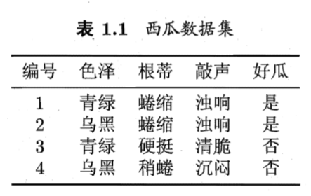
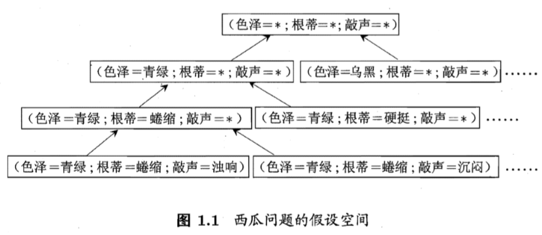
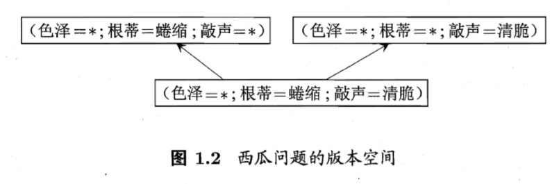
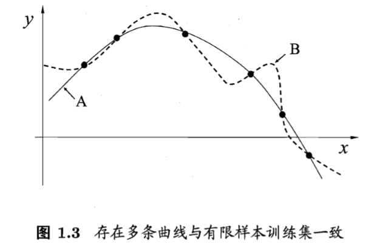
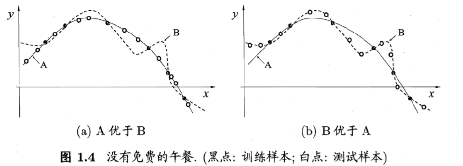
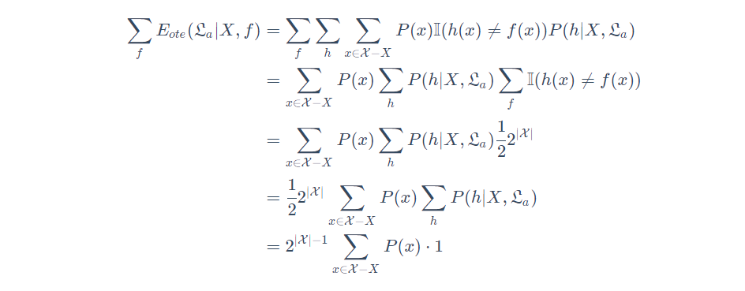
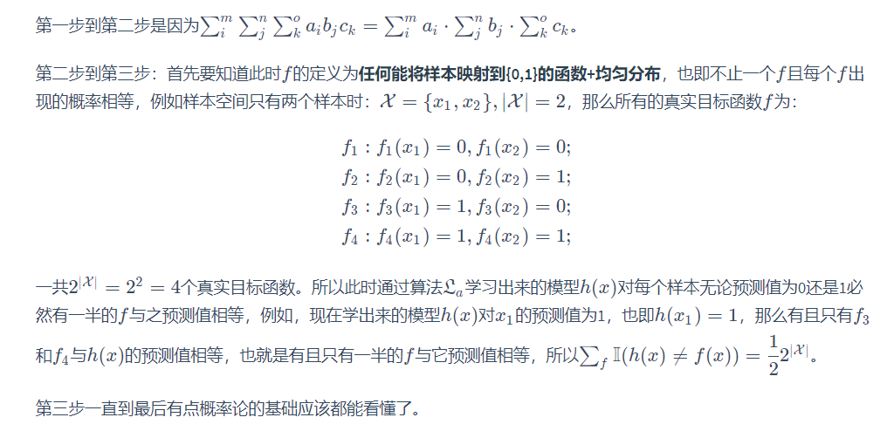

# 绪论

### 基本术语

+++++

|        术语        |                   释义                   |
| :----------------: | :--------------------------------------: |
|     示例 样本      |        关于一 个事件或对象的描述         |
|     属性 特征      | 反映事件或对象在某方面的表现或性质的事项 |
|       属性值       |               属性上的取值               |
| 属性空间  样本空间 |             属性张成的空 间              |
|      特征向量      |     一个示例于空间中对应一个坐标向量     |

### 分类

++++

$$
\begin{equation}
按学习任务分类
\left\{  
             \begin{array}{**lr**}  
             监督学习 \qquad \Rightarrow 分类	回归 \\  
             无监督学习\qquad   \Rightarrow 聚类
             \end{array}  
\right.  
\end{equation}
$$

### 假设空间

++++++++

​	**归纳**与**横绎**是科学推理的两大基本手段.

<ul>
    <li><b>归纳</b>：是从特殊到一般的"泛化"过程,即从具体的事实归结出一般性规律</li>
    <li><b>演绎</b>：从一般到特殊的"特化"叫过程，即从基础原理推演出具体状况</li>
</ul>

​		把学习过程看作一个在所有假设组成的空间中进行 搜索的过程，搜索目标是找到与训练集"匹配"的假设，即能够将训练集中的瓜判断正确的假设.假设的表示一旦确定，假设空间及其规模大小就确定了。

</img>

​		**机器学习中可能的函数构成的空间称为“假设空间”。**

​		**版本空间**：现实问题中我们常面临很大的假设空间?但学习过程是基于 有限样本训练集进行的，因此，可能有多个假设与训练集一致，即存在着一个与训练集一致的"假设集合"，我们称之为"版本空间"  

</img>

​		版本空间学习算法搜索预定空间的假设，被视为一组逻辑语句，版本空间的求取方法：

​			①写出假设空间：先列出所有可能的样本点（即特征向量）（即每个属性都取到所有的属性值）

​			②对应着给出的已知数据集，将与正样本不一致的、与负样本一致的假设删除

</img>

### 归纳偏好

+++++

​		机器学习算法在学习过程中对某种类型假设的偏好，称为**"归纳偏好" **, 或简称为"偏好"。任何一个有效的机器学习算法必有其归纳偏好，否则它将被假设空间中看似在训练集上"等效"的假设所迷惑，而无法产生确定的学习结果。

​		例如，若认为相似的样本应有相似的输出，则对应的学习算法可能偏好图1.3 中 比较"平滑"的曲线 A 而不是比较"崎岖"的曲线 B。

</img>

#### 奥卡姆剃刀原则：

​		**若有多个假设与观察一致，则选最简单的那个**

​		例如曲线 A 更易于描述，其方程式是$ y = x^2 + 6x + 1$，而曲线 B 则要复杂得多)，则在 图1.3 中我们会自然地偏好"平滑"的曲线 A.

​		我们希望并相信**$ \zeta _A$**比**$ \zeta_B$**更好，但会出现图1.4(b)的 情况:与 A 相比， B 与训练集外的样本更一致。

</img>

​		假设样本空间 $\chi$和假设空间组$\mathcal{H}  $都是离散的.令$P(h|X，\zeta_a)$  代表算法$\zeta_a$基于训练数据 $X$ 产生假设 $h$ 的概率，再令 $f$ 代表我们希望学习的真实目标函数.$\zeta_a$的"训练集外误差"，即$\zeta_a$在训练集之外的所有样本上的误差为:
$$
E_{ote}(\zeta_a|X,f)=\displaystyle \sum^{}_{h}{\sum_{\mathcal{x} \in \mathcal{X}-X}P(\mathcal{x}) \mathbb{I}(h(\mathcal{x})\neq f(\mathcal{x}))P(h|X,\zeta_a){}}
$$
​		考虑二分类问题，且真实目标函数可以是任何函数$\mathcal{X} \rightarrow \{0,1\}$，函数空间 为$\{0,1\}^{|\mathcal{X}|}$. 对所有可能的 $f$ 按均匀分布对误差求和，有
$$
E_{ote}(\zeta_a|X,f)=\displaystyle \sum_{f} \sum^{}_{h}{\sum_{\mathcal{x} \in \mathcal{X}-X}P(\mathcal{x}) \mathbb{I}(h(\mathcal{x})\neq f(\mathcal{x}))P(h|X,\zeta_a){}}  \\
$$
​		推导如下：</img>

</img>

​		 **NFL 定理有一个重要前提:所有"问题"出现的机会相同或所有问题同等重要。但实际情形并不是这样**

