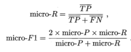

模型评估与选择

### 误差·拟合

+++

​		通常我们把分类错误的样本数占样本总数的比例称为"错误率" :
$$
错误率：E=a/m \\
精度：accuracy=1-E
$$
​	误差有两类：

<ul>
    <li><b>训练误差</b>：学习器在训练集上的误差称为"训练误差" 或"经验误差"</li>
    <li><b>泛化误差</b>：在新样本上的误差</li>
</ul>
​		学习的两大现象：

* **过拟合**：当学习器把训练样本学得"太 好"了的时候，很可能巳经把训练样本自身的一些特点当作了所有潜在样本都 会具有的一般性质，这样就会导致泛化性能下降。
* **欠拟合**：指对训练样本的一般性质尚未学好。

### 评估方法

++++

​		理想的解决方案当然是对候选模型的泛化误差进行评估，然后选择泛化误差最小的那个模型。

​		使用一个 **测试集**来测试学习器对新样本的判别能力，然后以测试集上的**"测试误差"** 作为泛化误差的近似估计，测试集应该尽可能与训练集互斥。通过对 **数据集**$D$ 进行适当 的处理，从中产生出训练集 $S $和测试集$ T$

##### 留出法

​		"留出法" 将数据集$ D$ 划分为两个互斥的集合,训练集 $S$，测试集 $T$， 即 $D=S \cup T,S \cap T=\empty$在S上训练出模型后，用 $T$ 来评估其测试误差，作为对泛化误差的估计.

​		若令训练集 $S$包含绝大多数样本,则训练出的模型可能更接近于用$D$ 训练出的模型， 但由于$T$ 比较小，评估结果可能不够稳定准确;

​		若令测试集 T 多包含一些样本， 则训练集 $S$与 $D$ 差别更大了，被评 估的模型与用 $D$  训练出的模型相比可能有较大差别?从而降低了评估结果的保真性

##### 交叉验证

​		"交叉验证法" 先将数据集$D$划分为 k 个大小相似的 互斥子集， 即:
$$
D=D_1 \cup D_2 \cup  ... \cup D_k,D_i \cap D_j = \empty (i \neq j)
$$

​		每个子集$ D_i $都 尽可能保持数据分布的一致性，即从 $D$中通过分层采样得到. 然后，每次用 k-1 个子集的并集作为训练集.其余的那个子集作为测试集;这样就可获得 k 组训练/测试集，从而可进行 k 次训练和测试. 最终返回的是这 k 个测试结果的均值 。

​		**留一法**：使用的训练集与初始数据集相比只少了一个样本，这就使得留一法中被实际评估的模型与期望评估的用 D 训练出的模型很相似.因此，留一法的评估结果往往被认为比较准确.（开销大）

##### 自助法

​		给定包含 $m $个样 本的数据集 $D$ ，我们对它进行采样产生数据集 $D'$: 每次随机从$D$中挑选一个 样本7,将其拷贝放入 $D'$ 然后再将该样本放回初始数据集 D .重复执行$ m $次后得到$D'$.样本在 $m $次采 样中始终不被采到的概率是$(1 一1/m)^m$， 取极限得到:
$$
\displaystyle \lim_{m \to \infin}{(1-\frac{1}{m})^m} \to \frac{1}{e} \approx 0.368
$$
​		是我们可将 $D'$ 用作训练集，$ D/ D'$ 用作测试集;这样实际评估的模型与期望评估的模型都使用 $m $个训练、样本，而我们仍有数据总量约$1/3$ 的、没在训 练集中出现的样本用于测试.这样的测试结果，亦称"包外估计" .

##### 调参与最终模型

​		把学习器预测结果$ f(x)$ 与真实标记 $y$进行比较.最常用的性能度量是"均方误差":
$$
E(f;D)=\frac{1}{m} \sum^{m}_{i=1}(f(x_i)-y_i)^2
$$
​		把此定理一般化：
$$
E(f;D)=\int_{x \in \mathcal{D}}(f(x_i)-y_i)^2
$$

### 性能度量

++++++++++++++++++++

##### 错误率与精度

+ **错误率**：分类错误的样本数占样本总数的比例；

+ **精度**：分类正确的样本数占样本总数的比例。

  ​	对样例集 $D$,分类错误率定义为:
  $$
  E(f;D)=\frac{1}{m} \sum^{m}_{i=1}\mathbb{I}(f(x_i) \neq y_i)
  $$
  

  ​	精度定义为：
  $$
  acc(f;D)=\frac{1}{m}\sum^{m}_{i=1}\mathbb{I}(f(x_i)=y_i)\\
  =1-E(f;D)
  $$
  

##### 查准率 查全率 $F1$

>​		在信息检索、 Web搜索等应用中经常出现?例如在信息检索 中，我们经常会关心"检索出的信息中有多少比例是用户感兴趣的" ," 用 户感兴趣的信息中有多少被检索出来了" **查准率**，**查全率**是更为适用于此类需求的性能度量.S

​		对于二分类问题，可将样例根据其真实类别与学习器预测类别的组合划分为**真正例($TP$)、假正例($FP$)、真反例($TN$)、 假反例($FN$)**四种情形，它们

查准率$P$与查全率$R$:

​		一般来说，查准率高时，查全率往往偏低;而查全率高时，查准率往往偏低。我们可根据学习器的预测结果对样例进行排序，排在前面的是学习器认为"最可能"是正例的样本?排在最后的则是学习器认为"最不可能"是正例的样本。按此顺序逐个把样本作为正例进行预测，则每次可以计算出当前的查全率、 查准率。以查准率为纵轴、查全率为横轴作图，就得到 了**查准率-查全率曲线**，简称 **"P-R曲线"**显示该曲线的图称为 **"P-R图"** ;

​			1.若一个学习器的 P-R 曲线被另一个学习器的曲线完全"包住", 则可断言 后者的性能优于前者。图 2.3 中学习器 A 的性能优于学习器 C; 

​			2.如果两个 学习器的 P-R 曲线发生了交叉，例如图 2.3 中的 A 与 B ； 这时一个比较合理的判据是比较 P-R 曲线面积的大小，但这个值不太容易估算.

​			3.**"平衡点 "** $BEP$就是这样一个度量，它是"查准率=查全率"时的取值;

​			4.但 $BEP$ 还是过于简化了些，更常用的是 $F1$ 度量:

​			5.然而用户对查全率，查准率有不同偏好；在此引出$F_\beta$，$\beta =1 $时，$F_\beta$退化为$F1$;当$\beta>1$时，$F_\beta$ 受查全率影响更大；当$\beta<1$时，$F_\beta$ 受查准率影响更大:

​			

​			6.当希望在 n 个二分类混淆矩阵上综合考察查准率和查全率：

​					$（1）$先在各混淆矩阵上分别计算出查准率和查全率。记为 $ (P_1,R_1),(P_2,R_2),...,(P_n,R_n)$再计算平均值，这样就得到**"宏查准率"  "宏查全率"**,以及相应的**"宏$F1$"** :

​				   	$(2)$先将各混淆矩阵的对应元素进行平均，得到$ TP、 FP、 TN、 FN $的平均值，分别记为 $\overline{TP}$、$\overline{ FP}$、$\overline{TN}$、$\overline{ FN} $，再基于这些平均值计算出"微查准率"、"微查全率" 和"微$F1$":

​	

##### ROC AUC

​		**ROC** 全称是**"受试者工作特征"** ：

​		我们根据学习器的预 测结果对样例进行排序，按此顺序逐个把样本作为正例进行预测，每次计算出两个重要量的值，分别以它们为横、纵坐标作图就得到了**”ROC 曲线“ **，其纵轴是**"真正例率"  TPR**，横轴是**"假正例率"  FPR**，两者分别定义为：
$$
TPR=\frac{TP}{TP+FN}\\
FPR=\frac{FP}{TN+FP}
$$

​		图 **2.4-(a)**给出了一个示意图，显然， 对角线对应于 "随机猜测" 模型，而点 (0， 1) 则对应于将所有正例排在所有反 例之前的"理想模型"

>​		给定 $m^+$ 个正例和 $m^-$ 个反例，根据学习器预测结果对样例进行排序，然后把分类阔值设为最大， 即把所有样例均预测为反例，此时真正例率和假正例率均为 0， 在坐标 (0， 0) 处标记一个点然后，将分类阐值依次设为每个样例的预测值，即依次将每个样例 划分为正例.设前一个标记点坐标为 (X， y)， 当前若为真正例，则对应标记点的 坐标为 $(x，y +\frac{1}{m^+})$;当前若为假正例，则对应标记点的坐标为 $(x+\frac{1}{m^-}，y)$，然 后用线段连接相邻点即得.

​		若一个学习器的$ ROC$ 曲线被另一 个学习器的曲线完全"包住"， 则可断言后者的性能优于前者;若两个学习器 的 $ROC$ 曲线发生交叉，则比较 $ROC$ 曲线下的面积，即 $AUC $，如上图所示.
$$
AUC=\frac{1}{2}\sum^{m-1}_{i=1}(x_{i+1})\times(y_i+y_{i+1})
$$
​		给定 $m^{+}$个正例和 $m^{-}$个反例?令 $D^{+}$ 和$D^{-}$一分别表示正、反例集合， 则排序"损失" (loss)定义为:
$$
\mathcal{l}_{rank}=\frac{1}{m^{+}+m^{-}}\sum_{x^{+} \in D^{+}}^{}\sum_{x^{-} \in D^{-}}^{}(\mathbb{I}(f(x^{+}<f(x^{-}))+\frac{1}{2}\mathbb{I}(f(x^{+}=f(x^{-}))
\\
AUC=1-\mathcal{l}_{rank}
$$

##### 代价敏感错误率与代价曲

>​       不同类型的错误所造成的后果不同. 例如在医疗诊断中，错误地把患者诊断为健康人与错误地把健康人诊断为患者， 看起来都是犯了"一次错误"但后者的影响是增加了进→步检查的麻烦,前者的后果却可能是丧失了拯救生命的最佳时机.

​		为权衡不同类型错误所造成的不同损失，可为错误赋予**"非均等代价"**。

​		若将表 2.2 中的第 0 类作为正类、第 1 类作为反类,令$D^+$  与 $D^-$分别代表样例集 D 的正例子集和反例子集

​		则"**代价敏感**"错误率为:
$$
E(f;D;cost)=\frac{1}{m}(\sum_{x_{i}\in D^{+}}\mathbb{I}(f(x_{i}) \neq cost_{01})+\sum_{x_{i}\in D^{-}}\mathbb{I}(f(x_{i}) \neq cost_{10}))
$$
​		在非均等代价下， ROC 曲线不能直接反映出学习器的期望总体代价，而 "代价曲线"则可达到该目的。

​		代价曲线图的横轴是取值为$ [0， 1] $的正例概率代价;其中 p 是样例为正例的概率;

​		纵轴是取值为 $[0， 1]$ 的归一化代价
$$
P(+)cost=\frac{p \times cost_{01}}{p \times cost_{01}+(1-p)\times cost_{10}}   \\
cost_{norm}=\frac{FNR \times p \times cost_{01}+FPR \times (1-p) \times cost_{10}}{p \times cost_{01}+(1-p)\times cost_{10}}
$$
​		 $ROC $线上每一点对应了代价平面上的一条线段，$ROC$中每个点$(TPR，FPR)$在代价平面上绘制 一条从 $(0,FPR)$ 到$ (1,FNR)$ 的线段，围成的面积为学习器的期望总体代价。

### 比较检验

+++++

​		**统计假设检验**为我们进行学习器性能比较提供了重要依据.基于假设检验结果我们可推断出学习器的性能如何。 

##### 假设检验

​		现实任务中我们并不知道学习器的泛化错误率，只能获知其测试错误率 $\hat{\epsilon}$泛化错误率与测试错误率未必相同，但直观上二者接近。因此， 可根据测试错误率估推出泛化错误率的分布。

​		泛化错误率为$\epsilon$的学习器被测得测试错误率为$\hat{\epsilon}$的概率: 
$$
P(\hat{\epsilon} ; \epsilon)=\left( \begin{array}{c}{m} \\ {\hat{\epsilon} \times m}\end{array}\right) \epsilon^{ \hat{\epsilon} \times m}(1-\epsilon)^{m-\hat{ \epsilon} \times m}
$$
​		给定测试错误率，则解$\partial P(\hat{\epsilon} ; \epsilon) / \partial \epsilon=0$可知，$P(\hat{\epsilon} ; \epsilon) $$在$ $\epsilon=\hat{\epsilon}$时最大，$|\epsilon-\hat{\epsilon}|$增大时$P(\hat{\epsilon} ; \epsilon)$ 减小.这符合二项分布，若 f = 0.3，则 10 个样本中测得 3 个被误分类的概率最大.

 		我们可使用"二项检验"来对"$\epsilon \leqslant 0.3$"(即"泛化错误率是否不大于 0.3" )这样的假设进行检验.更一般的，考虑假设 "$\epsilon \leqslant \epsilon_{0}$"，则在$1-\alpha$的概率内所能观测到的最大错误率如下式计算.这里 $1-\alpha$ 反映了结论的 "置信度"：
$$
\overline{\epsilon}=\max \epsilon \text { s.t. } \sum_{i=\epsilon_{0} \times m+1}^{m} \left( \begin{array}{c}{m} \\ {i}\end{array}\right) \epsilon^{i}(1-\epsilon)^{m-i}<\alpha
$$
​		此时若测试错误率 $\hat{\epsilon}$小于临界值 $\overline{\epsilon}$，则根据二项检验可得出结论:在 α 的显著度 下，假设"$\epsilon \leqslant \epsilon_{0}$"不能被拒绝，即能以$1-\alpha$的置信度认为，学习器的泛化错误率不大于$\epsilon_{0}$; 否则该假设可被拒绝，即在 α 的显著度下可认为学习器的泛化错误率大于$\epsilon_{0}$.

​		在很多时候我们并非仅做一次留出法估计，而是通过多次重复留出法或是 交叉验证法等进行多次训练/测试，这样会得到多个测试错误率， 此时可使用 "t 检验"。假定我们得到了 k 个测试错误率，$\hat{\epsilon}_{1}, \hat{\epsilon}_{2}, \ldots, \hat{\epsilon}_{k}$，则平均测试错误率 $\mu$和方差$\sigma^{2}$：
$$
\begin{array}{c}{\mu=\frac{1}{k} \sum_{i=1}^{k} \hat{\epsilon}_{i}} \\ {\sigma^{2}=\frac{1}{k-1} \sum_{i=1}^{k}\left(\hat{\epsilon}_{i}-\mu\right)^{2}}\end{array}
$$
​		考虑到这 k 个测试错误率可看作泛化错误率$\epsilon$的独立采样，则变量
$$
\tau_{t}=\frac{\sqrt{k}\left(\mu-\epsilon_{0}\right)}{\sigma}
$$
​		服从自由度为 k-1的 t 分布，如图 2.7 所示.

